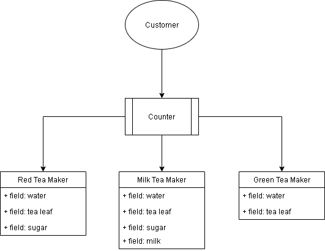

#  ডিজাইন প্যাটার্ন (Design Pattern)
ডিজাইন প্যাটার্ন হল এমন একটি সমাধান সেট যা ব্যবহৃত একটি বিশেষ ধরনের সমস্যার ক্ষেত্রে। সফটওয়্যা ডিজাইনের জন্য ডিজাইন প্যাটার্ন বিশেষভাবে গুরুত্বপূর্ণ। এটি কোডের জটিলতা কমানো, মেইনটেইনান্স এবং একই কাজ বারবার করা থেকে সাহায্য করে।

বাস্তব দুনিয়ার ক্ষেত্রে যদি চিন্তা করি আমার একটি চায়ের দোকান আছে এখন আমি এখানে ৩ ধরনের চা বিক্রি করি দুধ চা, লাল চা আর গ্রিন টি। এখন যখন কাস্টমার যখন চায়ের অর্ডার দেয় তখন সে যাই চা খেতে চাই সেটা বানানো শুরু করি। এখন ৩ ধরনের চা বানানোর প্রক্রিয়া তো ৩ রকম এবং কাস্টমারের সংখ্যা ও অনেক বেশি। সুতরাং যেখানে আমি চা বানাচ্ছি সেখানে প্রতিনিয়ত অর্ডার অনুযায়ী সিস্টেম পরিবর্তন করা লাগতেছে। এখানে কাজের গতি বাড়ানো আর ভাল ব্যবস্থাপনার জন্য আমাকে একটা ডিজাইন প্যাটার্ন বানাতে হবে।
রান্নাঘরে ৩ টা আলাদা জায়গা থাকবে যেখানে ৩ ধরনের চা আলদা ভাবে বানানো হবে। আর যেহেতু ৩ জায়গায় নির্দিষ্ট ক্যটাগরির চা তৈরী হবে তখন আমাদের প্রসেস আর পরিবর্তন করা লাগবে না। তখন কাস্টমার অর্ডার দেওয়ার সাথে সাথে নির্দিষ্ট জায়গায় অর্ডার চলে যাবে। 

ডিজাইন প্যাটার্ন ৩ ধরনের হয় সাধারণতঃ
* [Creational](Creational.md)
* [Structural](Structural.md)
* [Behavioral](Behavioral.md)